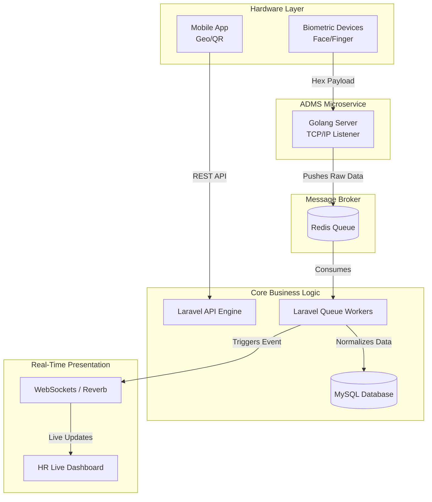

# 🚀 GotIt — Enterprise HR & Biometric Automation Platform

**GotIt HR** is a high-throughput, enterprise-grade Human Resources, Asset, and Biometric Attendance platform. Designed for immense scalability, it replaces fragmented HR systems with a unified, real-time data pipeline.

---

## 🧩 Comprehensive Module Ecosystem

GotIt is built as a complete ERP for HR, divided into highly advanced, interconnected modules.

### 🏢 1. Company & Branch Management
* **Multi-Tenant Architecture:** Manage multiple sister companies or sub-brands under a single master admin umbrella.
* **Branch Mapping:** Define unlimited physical office branches, assigning specific IP limits, geo-fences, and biometric devices to each location.
* **Global Policies:** Set company-wide shift and holiday policies that inherit down to specific branches or departments.

### 👥 2. Advanced User Management
* **Full Employee Lifecycle:** From digital onboarding to offboarding, keeping operations completely paperless.
* **Document Vault:** Secure, encrypted storage for employee KYC, ID proofs, and legal contracts.
* **Hierarchy Mapping:** Define strict reporting managers (L1, L2) to automate approval routing across the entire organization.

### 🛡️ 3. Dynamic Roles & Permissions (RBAC)
* **Granular Matrix:** Build completely custom roles (e.g., *Junior HR*, *Branch Manager*, *Super Admin*) using a dynamic, toggle-based permission matrix.
* **Module-Level Access:** Restrict users from viewing, editing, or deleting data down to specific database resources (e.g., hide salary modules from standard HRs).
* **Audit Logging:** Immutably log every action taken by any role for compliance and security forensics.

### 📍 4. Multi-Modal Attendance Engine (Face/Geo/Scan)
* **Go-Powered Biometrics:** Physical fingerprint and facial recognition scanners sync in real-time using our custom Golang ADMS server.
* **Geo-Location Check-in:** Mobile punching enforced by strict GPS radiuses (Geo-Fencing) and advanced anti-spoofing algorithms (mock-location prevention).
* **QR & Scan Check-in:** Dynamic, encrypted QR codes placed at office entrances that regenerate every 5 seconds to prevent proxy attendance.

### 🌴 5. Intelligent Leave Management
* **Automated Accruals:** The system automatically credits Casual, Sick, and Earned leaves based on employee tenure and company policy configurations.
* **Approval Workflows:** Requests trigger real-time push notifications and emails to assigned L1/L2 managers for one-click approvals.
* **LWP Integration:** Seamlessly syncs with the payroll engine to deduct salaries accurately for Unauthorized Leaves (Leave Without Pay).

### 💻 6. Asset Management
* **Inventory Tracking:** Catalog all company assets across branches (Laptops, Phones, ID Cards, Vehicles).
* **Allocation & Recovery:** Assign assets to users during onboarding and automatically generate mandatory recovery checklists during offboarding.
* **Condition Logging:** Track asset health, serial numbers, and maintenance histories over time.

---

## ⚙️ Visual System Architecture

Below is the pin-to-pin technical data flow, highlighting how the Golang server interacts with hardware while Laravel handles the heavy business logic.

---

## 🛠️ Deep-Dive: The Server Infrastructure

### 1. The Golang ADMS Server (Zero-Latency Hardware Comm)
To achieve zero-latency biometric processing, the standard HTTP layer was bypassed entirely. 
*   **Custom Go Server:** Engineered to maintain persistent TCP/IP connections with hundreds of physical devices globally simultaneously.
*   **High-Throughput Fetching:** Listens for raw hex punch data, instantly decodes it, and pushes the payload into a high-speed Redis queue, ensuring hardware is never bottlenecked by database locks.

### 2. The Laravel Core Engine & Queue Workers
*   **Asynchronous Processing:** Laravel daemon workers continuously consume the Redis queues. They process raw punches, match them against complex shift rosters, and calculate late marks or half-days entirely in the background.
*   **Unified Gateway:** Serves secure REST APIs for the frontend dashboards using strict JWT authentication.

### 3. Real-Time WebSocket Pipeline
*   Instead of polling the database, the system uses WebSockets. When the Go server pushes a punch, an event is instantly broadcasted. Managers see employees clock in on their live dashboard the exact millisecond their finger touches the scanner.

---

### 📬 Get in Touch
Interested in learning more about the architecture or trying out the product? 
- **Website:** [gotit4all.com](https://gotit4all.com)
- **Contact:** info@gotit4all.com
- **Phone:** +91 96069 75900
